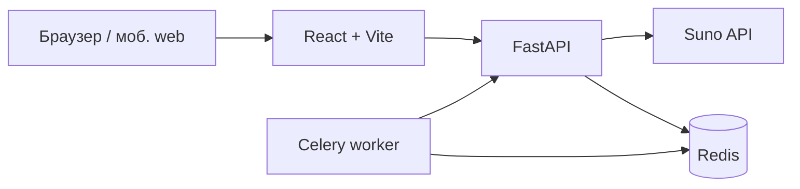

<div align="center">

# MelodyGift KG

**Персонализированные музыкальные подарки — веб-приложение с генерацией через AI для рынка Кыргызстана**

*AI-powered personalized music gifts — web application*

<br />


<br />

[Возможности](#-возможности) · [Архитектура](#-архитектура) · [Быстрый старт](#-быстрый-старт) · [API](#-api) · [Конфигурация](#-конфигурация) · [Развёртывание](#-развёртывание)

</div>

---

## О проекте

**MelodyGift KG** — это **веб-приложение** (React + Vite): пользователь создаёт уникальную подарочную песню в браузере — сценарий, имена, стиль и язык собираются в промпт, генерацию выполняет **Suno API** ([sunoapi.org](https://docs.sunoapi.org/)).

Интерфейс рассчитан на **десктоп и мобильные браузеры**. В коде есть **опциональная** интеграция с Telegram WebApp API (`@twa-dev/sdk`): при открытии страницы внутри Telegram доступны нативные уведомления, хаптика, тема и шаринг — но продукт в первую очередь **обычный сайт**, а не Telegram Mini App.

Первый этап — музыкальные подарки; далее планируется линейка персонализированных книг и расширение монетизации.

---

## Возможности

| Область | Что есть |
| -------- | --------- |
| **Генерация** | Персонализированные песни по правилам промпта (в т.ч. демо ~40 с и покупка полной версии, **1000 сом**) |
| **Локализация** | Русский и кыргызский (`ru`, `kg`) |
| **Продукт** | Получатели, жанры/стилевые настройки, адаптивный UI |
| **Монетизация** | Кредиты, транзакции, задел под LocalPay / Optima Bank |
| **Админка** | Статистика (выручка, оценка чистой прибыли с учётом себестоимости генерации), список песен, ручное подтверждение оплаты (`X-Admin-Secret`) |

---

## Архитектура



**Стек**

| Слой | Технологии |
| ---- | ----------- |
| **Backend** | Python 3.11+, FastAPI, SQLAlchemy, Redis, Celery, интеграция Suno |
| **Frontend** | React 18, Vite, Tailwind CSS, i18next; опционально `@twa-dev/sdk`, если страница открыта в Telegram |

---

## Быстрый старт

### Требования

- Node.js **18+**
- Python **3.11+**
- Redis — **опционально** для разработки (желательно для production и фонового опроса Suno через Celery)

### Backend

```bash
cd backend
python -m venv venv
# Windows:
venv\Scripts\activate
# macOS / Linux:
# source venv/bin/activate

pip install -r requirements.txt
cp .env.example .env   # заполните ключи и секреты
uvicorn main:app --host 0.0.0.0 --port 8000 --reload
```

**Celery worker** (рекомендуется для стабильного опроса задач Suno):

```bash
cd backend
celery -A tasks worker -l info
```

### Frontend

```bash
cd frontend
npm install
# создайте frontend/.env — см. раздел «Frontend» ниже
npm run dev
```

**Production-сборка фронтенда:**

```bash
cd frontend
npm run build
npm run preview   # локальная проверка билда
```

---

## Структура репозитория

```
melodygift-kg/
├── backend/
│   ├── main.py              # FastAPI-приложение, маршруты API
│   ├── config.py            # настройки из окружения
│   ├── tasks.py             # Celery-задачи (опрос Suno и др.)
│   ├── prompt_builder.py    # сборка промптов
│   ├── suno_job_store.py    # состояние задач / Redis
│   ├── services/            # Suno-клиент, prompt engine
│   ├── static/              # статика (примеры стилей и т.д.)
│   ├── requirements.txt
│   └── .env.example
├── frontend/
│   ├── src/
│   │   ├── api/
│   │   ├── components/
│   │   ├── pages/
│   │   ├── hooks/
│   │   ├── styles/
│   │   └── i18n/            # ru.json, kg.json, config.js
│   ├── index.html
│   └── package.json
└── README.md
```

---

## API

> Полный перечень эндпоинтов смотрите в `backend/main.py` (документация OpenAPI при локальном запуске: `/docs`).

**Песни и Suno**

| Метод | Path | Назначение |
| ----- | ------ | ----------- |
| `POST` | `/api/songs/generate` | Запуск генерации (Custom Mode Suno): текст, теги стиля, язык, списание кредитов |
| `GET` | `/api/songs/{song_id}` | Статус и детали трека |
| `POST` | `/api/songs/prepare-demo` | Подстановка имён и подготовка демо-текста |

**Пользователи и кредиты**

- `POST /api/users`, `GET /api/users/{user_id}`, `GET /api/users/{user_id}/credits`

**Получатели**

- `GET/POST /api/users/{user_id}/recipients`

**Платежи и покупки**

- `POST /api/users/{user_id}/transactions`
- `POST /api/purchase/{song_id}` — покупка полной версии демо (тело: `user_id`)

**Админ** (заголовок `X-Admin-Secret`)

- `GET /api/admin/stats`
- `GET /api/admin/songs`
- `POST /api/admin/songs/{song_id}/confirm-payment`

---

## Генерация через Suno

1. Экран **«Песня в самое сердце»** отправляет `POST /api/songs/generate` с текстом, стилем и языком.
2. Бэкенд формирует промпт (включая технические блоки по ТЗ) и вызывает **Suno Custom Mode**.
3. Готовность обычно **1–2 минуты**: при работающем **Celery** опрос идёт в воркере; без него возможен фоновый опрос в процессе FastAPI (см. код).

Обязательно задайте в `backend/.env` как минимум **`SUNO_API_KEY`** (остальное — в `backend/.env.example`).

---

## Конфигурация

### Backend (`backend/.env`)

Скопируйте `backend/.env.example` → `backend/.env` и заполните значения.

| Переменная | Назначение |
| ---------- | ---------- |
| `SUNO_API_KEY` | Ключ API Suno |
| `SUNO_API_BASE_URL` | Базовый URL API (по умолчанию `https://api.sunoapi.org/api/v1`) |
| `REDIS_URL` / `CELERY_*` | Очередь и бэкенд результатов Celery |
| `BACKEND_URL` | URL API для внутренних вызовов (например refund) |
| `INTERNAL_SECRET` | Секрет внутренних запросов worker → API |
| `ADMIN_SECRET` | Доступ к админ-эндпоинтам |

### Frontend (`frontend/.env`)

```env
VITE_API_URL=http://localhost:8000/api
```

При необходимости добавляйте свои переменные (например, для аналитики или ссылок на бота) — ориентируйтесь на использование в `frontend/src`.

---

## Развёртывание

1. Соберите фронтенд: `npm run build`, отдайте статику через CDN/NGINX или хостинг (Vercel, Netlify, свой сервер).
2. Запустите API за **HTTPS** в production; укажите `VITE_API_URL` на публичный URL API.
3. Настройте приём платежей и вебхуки эквайеров при подключении **LocalPay**, **Optima Bank** и т.п.

Страницу по желанию можно **дополнительно** открыть из Telegram (как обычную веб-ссылку или через WebApp), но это не обязательная модель продукта.

---

## Локализация

- Русский (`ru`) — по умолчанию  
- Кыргызский (`kg`)  

Новый язык: добавьте `frontend/src/i18n/<код>.json`, зарегистрируйте в `frontend/src/i18n/config.js`.

---

## Дорожная карта

| Этап | Статус |
| ---- | ------ |
| Музыкальные подарки, RU/KG, кредиты, Suno, демо/апсейл | Текущий фокус продукта |
| Персонализированные книги | Запланировано |
| Мобильные приложения, B2B | Запланировано |

---

## Поддержка

- Telegram: **@melodygift_support**
- Email: **support@melodygift.kg**

---

## Лицензия

Условия использования кода уточняйте у владельцев репозитория. При добавлении файла `LICENSE` в корень проекта руководствуйтесь им.

---

<div align="center">

**MelodyGift KG** — сделано с вниманием к музыке и людям в Кыргызстане.

</div>
